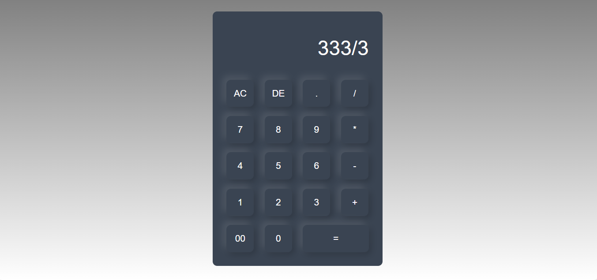
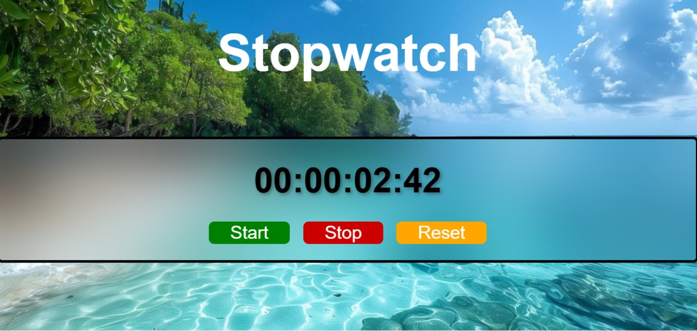
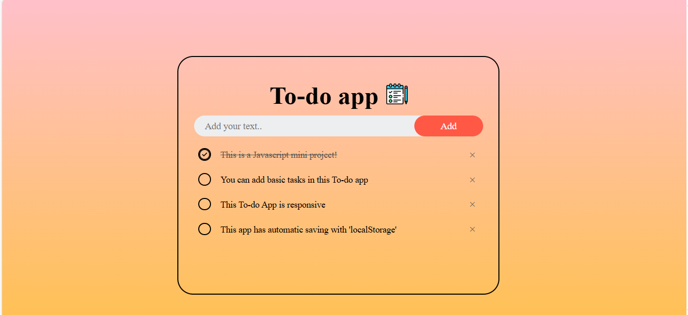
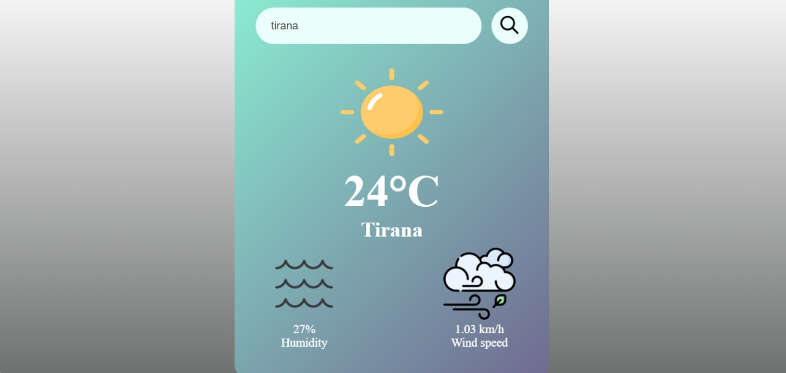

 # JavaScript Mini Projects

         This is my collection of small JavaScript projects!  
These mini-projects are built to practice and improve my front-end development skills.  
  Each project is organized in its own folder and includes HTML, CSS, and JavaScript.

##  PROJECTS:

### 🧮 Calculator
A calculator that performs arithmetic operations like addition, subtraction, multiplication, and division.  
Built with vanilla HTML, CSS, and JavaScript.

## How to Use

1. Clone the repository or download the project files.
2. Open `index.html` in your browser.
3. Start performing arithmetic calculations easily and quickly.

### 🎲 Dice Roller
A fun dice roller that simulates rolling one or more dices with random results.  
Built with  HTML, CSS, and JavaScript.

## How to Use

1. Clone the repository or download the project files.
2. Open `index.html` in your browser.
3. Click the roll button to generate random dice outcomes.

### 🕒 Digital Clock
A simple digital clock that displays the current time in real-time.  
Built with HTML, CSS, and JavaScript.

## How to Use

1. Clone the repository or download the project files.
2. Open `index.html` in your browser.
3. View the live updating clock instantly.

### 📏 Length Converter
A simple tool to convert between different units of length (centimetres,meters, inches, feet,).  
Built with HTML, CSS, and Vanilla JavaScript.

## How to Use

1. Clone the repository or download the project files.
2. Open `index.html` in your browser.
3. Enter a value in centimetres and select the units to get the converted result instantly.

### ⏱️ Stopwatch
A stopwatch to measure elapsed time with Start, Stop, and Reset functionality.  
Built with HTML, CSS, and JavaScript.

## How to Use

1. Clone the repository or download the project files.
2. Open `index.html` in your browser.
3. Start, stop or reset, with a simple click.

### 🌡️ Temperature Converter
A simple tool to convert temperatures between Celsius and Fahrenheit. 
Built with vanilla HTML, CSS, and JavaScript.

## How to Use

1. Clone the repository or download the project files.
2. Open `index.html` in your browser.
3. Enter a temperature, select the input and output units, and get the converted result instantly by clicking the convert button.

### ✅ To-Do App
A modern designed task management app.  
Features:
- Add tasks
- Click to mark tasks as completed
- Delete tasks
- Automatic saving with `localStorage`
- Responsive layout with modern styling for a pleasant user experience

## How to Use
1. Clone the repository or download the project files.
2. Open `index.html` in your browser.
3. Start adding or deleting your tasks!

### ☁️ Weather App
A weather application that shows real-time weather information for any city.  
Built with HTML, CSS, and JavaScript using a weather API.

## How to Use

1. Clone the repository or download the project files.
2. Open `index.html` in your browser.
3. Enter a city name from all over the world to view the current weather details.

## 🔧 Purpose of this repo
This repository is for practice and to showcase my progress as a front-end developer.  
I will continue to add new projects!

---
