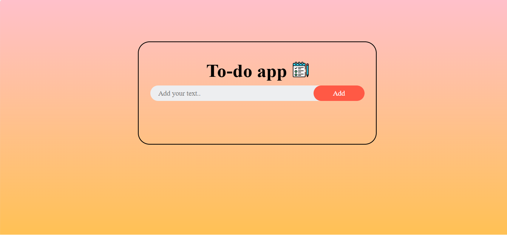

 # JavaScript Mini Projects

         This is my collection of small JavaScript projects!  
These mini-projects are built to practice and improve my front-end development skills.  
  Each project is organized in its own folder and includes HTML, CSS, and JavaScript.

##  PROJECTS:
### ✅ To-Do App
A beautifully designed task management app.  
Features:
- Add tasks
- Click to mark tasks as completed
- Delete tasks
- Automatic saving with `localStorage`
- Responsive layout with modern styling for a pleasant user experience

## How to Use
1. Clone the repository or download the project files.
2. Open `index.html` in your browser.
3. Start adding or deleting your tasks!

### 🧮 Calculator
A calculator that performs arithmetic operations like addition, subtraction, multiplication, and division.  
Built with vanilla HTML, CSS, and JavaScript.

## How to Use

1. Clone the repository or download the project files.
2. Open `index.html` in your browser.
3. Start performing arithmetic calculations easily and quickly.

## 🔧 Purpose of this repo
This repository is for practice and to showcase my progress as a front-end developer.  
I will continue to add new projects!

---
